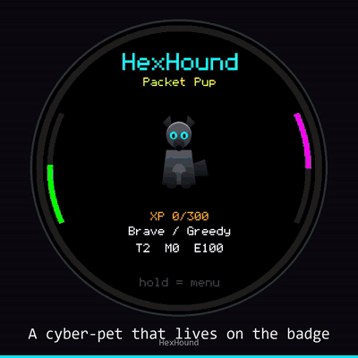

# HexHound

**An open-source cybersecurity digital pet for ESP32 hardware.**

HexHound grows by performing authorized Wi-Fi reconnaissance, BLE discovery, and
security-awareness missions. Patrol your environment, surface potential risks,
earn XP, and evolve from an Egg into a Sentinel.

> **Project status: active alpha.**
> Wi-Fi and BLE patrols, pet progression, persistence, hardware diagnostics and
> the desktop simulator are working. USB HID missions require a **separate
> firmware build** and are not part of the recommended T-Dongle S3 image. Four
> of the seven board targets are validated on physical hardware; the rest
> compile but are unverified. See [Known limitations](#known-limitations).

[](https://github.com/h4d35x0/hexhound/actions/workflows/build.yml)


<p align="center">
  
</p>
<p align="center">
  <em>The 480x480 round board: craft from patrol salvage, dress the pet, furnish its den,
  run a Wi-Fi and BLE patrol, then the security missions Gremlin Mode unlocks.</em>
</p>
<p align="center">
  <a href="https://github.com/h4d35x0/hexhound/releases/latest">Full-quality demo video</a>
  (69s, 1080p, no audio) is attached to the latest release, in square and vertical cuts.
  The clip above is a size-reduced GIF so the repository stays small to clone.
</p>

## What HexHound does

- Scans for nearby Wi-Fi access points and flags open or duplicate SSIDs
- Discovers BLE devices and flags those matching configurable tracker heuristics
- Turns that activity into XP, traits, stats and evolution across five stages
- Runs on seven compact ESP32 boards with compile-time capability detection
- Includes an SDL2 desktop simulator with realistic fake Wi-Fi and BLE data
- Offers optional USB HID security-awareness missions on compatible hardware
- Stores pet progress, config, discoveries and journal entries locally
- Drives capacitive touch as an input source on the boards that have a panel,
  so a tap lands on the row you are looking at instead of stepping to it

HexHound does **not** capture credentials, bypass authentication, install
persistence, exfiltrate data, or exploit nearby devices. Wi-Fi and BLE patrols
are passive discovery only.

## Choose your path

| I want to... | Go to |
|--------------|-------|
| Flash a board I already own | [Quick start](#quick-start) |
| Try it with no hardware | [Desktop simulator](#desktop-simulator) |
| Understand or contribute to the code | [docs/architecture.md](docs/architecture.md) · [CONTRIBUTING.md](CONTRIBUTING.md) |

## Supported hardware

Feature columns describe what the board physically has and what the firmware
enables for it. **Validated** means HexHound has been run on that board and
confirmed working; everything else compiles but is unverified on real hardware.

| Board | Validated | Wi-Fi | BLE | USB HID | Battery | Touch | IMU | SD |
|-------|:---------:|:-----:|:---:|:-------:|:-------:|:-----:|:---:|:--:|
| [LilyGo T-Dongle S3](https://github.com/Xinyuan-LilyGO/T-Dongle-S3) | **Yes** | Yes | Yes | Separate build | No | No | No | Yes |
| [Waveshare 1.47B](https://www.waveshare.com/wiki/ESP32-S3-LCD-1.47B) | **Yes** | Yes | Yes | No build provided | No | No | No | Yes |
| [Waveshare 1.28 round](https://www.waveshare.com/wiki/ESP32-S3-LCD-1.28) | **Yes** | Yes | Yes | Unavailable | Yes | No | Yes | No |
| [LilyGo T-Display S3](https://github.com/Xinyuan-LilyGO/T-Display-S3) | No | Untested | Untested | No build provided | Yes | No | No | No |
| [Waveshare Touch 1.47](https://docs.waveshare.com/ESP32-S3-Touch-LCD-1.47) | No | Untested | Untested | No build provided | Yes | Yes | No | No |
| [LilyGo T-Dongle C5](https://github.com/Xinyuan-LilyGO/T-Dongle-C5) | No | Untested | Untested | No build provided | No | No | No | Unavailable |
| [LilyGo T-RGB 2.1in round](https://github.com/Xinyuan-LilyGO/T-RGB) | **Yes** | Yes | Yes | Separate build | Yes | **Yes** | No | Unavailable |

- **Separate build** - the capability exists but needs a dedicated HID
  environment (`t-dongle-s3-hid`, `lilygo-t-rgb-hid`) rather than the
  recommended image. A HID image is a keyboard, not a serial port: it has no
  console, and re-flashing it needs the ROM download mode (hold BOOT while
  plugging in).
- **Unavailable** - the hardware cannot do it. The round board reaches USB
  through a CH343P UART bridge, so it has no native USB HID. The C5's SD and
  LCD share SPI pins, so SD stays disabled until a shared-bus implementation
  lands. The T-RGB's card slot is **SDMMC**, not SPI - the first non-SPI SD in
  this codebase - so it is declared absent rather than mis-declared as SPI.
- **No build provided** - the chip supports HID, but HexHound ships no HID
  environment for that board.

> **The round boards share one layout family** (`src/ui/ui_round.*`):
> chord-aware text, rim arc gauges, a circular alert border. It is selected at
> compile time and adds nothing to any other board's firmware. The same code
> serves both the 240x240 Waveshare 1.28 and the 480x480 T-RGB - generalised
> rather than forked - because every hand-tuned constant is expressed through
> `uiround::scaled()`, which reproduces the 240 value exactly by construction.
>
> The Waveshare 1.28's sibling **ESP32-S3-Touch-LCD-1.28** is a *different*
> board and is not this target; flashing this image to it leaves the display
> dark.
>
> **The T-RGB is a different display stack, not just a bigger panel.** Its
> ST7701S is driven by the ESP32-S3's RGB *parallel* LCD peripheral with a
> framebuffer in PSRAM, and the panel's own SPI init lines are pins on an
> XL9535 I2C expander rather than GPIOs. TFT_eSPI cannot drive it at all; see
> `src/hal/rgb_panel_trgb.*`. It is also the only round board with native USB.

Typical board cost is roughly **$15-30 as of August 2026**, excluding shipping
and optional storage. See the [bill of materials](docs/bom.md).

## Quick start

Requires [PlatformIO](https://platformio.org/install/ide?install=vscode).

```bash
git clone <repo> && cd hexhound

pio run -e lilygo-t-dongle-s3-vendor-app       -t upload   # T-Dongle S3 (recommended)
pio run -e waveshare-esp32-s3-lcd-147b         -t upload   # Waveshare 1.47B
pio run -e waveshare-esp32-s3-lcd-128          -t upload   # Waveshare 1.28 round
pio run -e lilygo-t-display-s3                 -t upload   # T-Display S3
pio run -e waveshare-esp32-s3-touch-lcd-147    -t upload   # Waveshare Touch 1.47
pio run -e lilygo-t-rgb                        -t upload   # LilyGo T-RGB 480x480 round
```

**The T-RGB parks in the ROM download mode after every flash.** Neither
esptool's RTS reset nor a host DTR/RTS pulse reliably brings it out, and the
board is simply silent until you reset it. Press reset, or unplug and replug;
that is expected on this board, not a failed flash.

**The T-Dongle C5 is different: it needs its own PlatformIO core directory.**

```bash
# Linux / macOS
PLATFORMIO_CORE_DIR="$HOME/.platformio-c5" pio run -e lilygo-t-dongle-c5-vendor-app -t upload

# Windows PowerShell (drive-root path on purpose - Windows MAX_PATH)
$env:PLATFORMIO_CORE_DIR="C:\c5"; pio run -e lilygo-t-dongle-c5-vendor-app -t upload
```

The C5 uses the pioarduino platform, which publishes under the same package
names as the stock one. Building it in your shared PlatformIO home strips
`tools/sdk` out of `framework-arduinoespressif32`, and every ESP32-S3 target
above then fails with `fatal error: freertos/FreeRTOS.h: No such file or
directory`. It is a large first download (~4 GB) and is reused after that.

`scripts/guard_c5_core_dir.py` refuses the build if you forget, but **it cannot
undo the damage** - PlatformIO installs the platform before any build script
runs, so the guard stops the build, not the package install. Set the variable.

Or let the release script handle isolation for you:
`python scripts/build_flashes.py <version>`.

**Flash the environment that matches your board.** Every ESP32-S3 image reports
the same chip family, so nothing prevents flashing the wrong one; the result is
a working firmware driving the wrong display pins, which looks like a dead
board. See [troubleshooting](docs/troubleshooting.md#flashing-the-wrong-board-image).

On first boot the pet starts as an Egg. **Short press** starts a patrol,
**long press** opens the menu. Hold the button during power-on to run the
hardware validation suite. SPIFFS auto-formats on first boot if it has never
been initialized, which on a freshly flashed board can keep the splash on
"Booting..." for a minute or two. That is the format running, not a hang.

### Controls

Most boards have one button. The T-Display S3 has two, and gets a real Back.

| Gesture | One-button boards | T-Display S3 |
|---|---|---|
| A short | next / scroll / start patrol | same |
| A long | select / open menu | same |
| B short | n/a | **Back**, one level up |
| B long | n/a | unassigned |
| Hold A+B 2s | n/a | **sleep**, press B to wake |

Button A is the BOOT button on every board. On the round 1.28 keychain there is
no second button and the IMU stands in: tilt acts as A short, shake as A long.

**On a board with a touch panel** (Waveshare Touch 1.47, LilyGo T-RGB) touch is
an *input source*, not a per-screen feature: it synthesises the same events the
button already drives, so no screen behaves differently and the button keeps
working exactly as before.

| Gesture | What it does |
|---|---|
| Tap a **menu** row | opens that row directly |
| Tap a **list** row (missions, quests, games, kit) | puts the cursor on that row |
| Hold a list row | puts the cursor there **and** opens it |
| Tap the **bottom strip** | Back, one level up |
| Swipe up / down | scroll the list |
| Tap during a **minigame** | registers on the way *down*, for reaction speed |

A tap on a list row deliberately does **not** open it: those rows craft an item
and spend the day's only reroll, and a mis-hit must not spend something you
cannot get back. The main menu can open on a tap because every row there is
navigation. A tap that misses every row does nothing rather than nudging the
cursor.

Touch is suppressed entirely during a roam. An expedition means the device is
in a pocket, and a pocket is a conductor: a capacitive panel pressed against a
leg is a far better fake finger than a knock is a fake shake.

Back goes **up one level**, not straight home: from a sub-screen to the menu,
from the menu to home. A long press still ends a patrol or a roam early on any
board, and whatever the outing already found is kept.

Full environment list, USB modes and display backends:
[docs/build-environments.md](docs/build-environments.md).

## Desktop simulator

No hardware needed. Fake Wi-Fi and BLE data is injected automatically (8 SSIDs
including duplicates and open networks, 5 BLE devices including a tracker
candidate).

```bash
# Linux
sudo apt install build-essential libsdl2-dev pkg-config
pio run -e desktop-sim-linux && .pio/build/desktop-sim-linux/program

# Windows (MinGW via MSYS2 - see TESTER_GUIDE.md)
pio run -e desktop-sim
.pio\build\desktop-sim\program.exe
```

| Key | Action |
|-----|--------|
| **SPACE** | Short press (patrol, scroll, dismiss) |
| **ENTER** | Long press (menu, select, back) |
| **S** | Save screenshot |
| **Q** | Quit |

The panel is chosen by **build environment**, not a runtime flag, because the
layout family is a compile-time decision:

| Environment | Panel |
|---|---|
| `desktop-sim` | 160x80 |
| `desktop-sim-wave` | 320x172 |
| `desktop-sim-round` | 240x240 round, with a circular bezel mask |
| `desktop-sim-round480` | 480x480 round (T-RGB) |

Any screen can be rendered headlessly, which is how the round layouts are
checked - `HEXHOUND_SIM_FORCE_SCREEN=<name>` with `HEXHOUND_SIM_SHOT_DIR` and
`HEXHOUND_SIM_SHOT_MS`. Boot takes about 4.3 seconds, so a shot earlier than
that captures the splash instead of the screen you asked for.

Screenshot galleries: [160x80](docs/screenshots) ·
[320x172](docs/screenshots/bigscreen) · [240x240 round](docs/screenshots/round)

## How it works

HexHound progresses through five stages, beginning as an Egg. Each stage
unlocks a capability, when the selected board supports it.

| Stage | Name | Unlocks | Threshold |
|-------|------|---------|-----------|
| 1 | Egg | Incubating | - |
| 2 | Packet Pup | Wi-Fi reconnaissance | 10 interactions + 1 Wi-Fi scan + 1 USB connect |
| 3 | Beacon Beast | BLE discovery | 300 XP |
| 4 | Gremlin Mode | USB HID missions | 900 XP |
| 5 | Sentinel | Anomaly heuristics | 2,400 XP |

A patrol runs a Wi-Fi scan (plus BLE from Beacon Beast onward), reports networks
found and anything flagged, then feeds hunger and grants XP. Seven stats track
the pet; hunger, mood and energy decay over time, so it needs regular
interaction. At hatch it gains two of six personality traits, which alter stat
multipliers. Reaching Sentinel unlocks Mastery XP and named perks.

Full details: [docs/architecture.md](docs/architecture.md).

### Items, crafting, the den and the closet

Activity yields craftable materials, and materials become cosmetics. Nothing
here changes a stat: crafting spends materials for an appearance and nothing
else.

| Activity | Yields |
|---|---|
| Patrol | Scrap from networks seen, Signal Frag from new Wi-Fi, Data Shard from new BLE |
| Roam | The same at better rates, plus the rare half: Copper Wire, Ferrite Bead, Circuit Bit, Cracked Lens |
| Minigame (finished) | Scrap, Circuit Bit, and Glitch Frag at higher scores |

Every yield is integer division, so a thin patrol legitimately returns nothing
rather than rounding up into a free material, and an *abandoned* game round
returns nothing at all. Two rules constrain the table in
`src/content/material_yield.h`, both enforced by tests: every material has to be
reachable on a board that cannot count steps (the T-RGB cannot, and four
recipes would otherwise be impossible on it), and every activity has to yield
at least one material an early recipe actually wants.

Craft in **KIT**: the list is BACK, your materials, then every recipe including
the ones still locked, so you can see what to work toward. The footer names what
a hold will do on the highlighted row - `hold=make`, `short`, `locked` - and a
finished cosmetic says where it goes: `HAVE:DEN`, `HAVE:WORN` or `HAVE:FX`.

A cosmetic is one of a kind. You cannot craft a second DESK LAMP, and there is
nothing to gain by trying.

**Where each kind ends up:**

| Kind | Goes | Screen |
|---|---|---|
| `HAVE:DEN` | stands in the pet's room | **DEN** |
| `HAVE:WORN` | on the pet's head or neck | **CLOSET** |
| `HAVE:FX` | orbits the pet on the home screen | **CLOSET**, the FX row |

Both screens use the same single verb: **hold to cycle**. A slot or an anchor
walks through bare, then every owned item that fits it, then bare again - so one
press is place, swap and remove, with no mode to be in. The footer always names
what the next hold will do (`hold:DESK`, `hold=clear`, `hold=off`, `craft more`).

The **DEN** grows with your collection rather than showing its ceiling from the
first boot: it shows at least three places, and at least one free place
for the next thing you make. A pet wears what it is wearing everywhere it is
drawn - home, den, patrol radar, and through the evolution cutscene - and
evolving never takes anything off.

There are eight den cosmetics, four worn ones and three flourishes. At Packet
Pup you can reach four den items, a hat and a scarf; the rest gate later. Eight
den pieces for eight brackets, so a fully kitted pet can fill its room.

A pet wears its cosmetics on the home screen, in the den, on the patrol radar
and through the whole evolution cutscene, and keeps them when it is hungry. The
only time they are not drawn is during the two brief event animations (happy,
2 to 5 seconds; alert, 4), where the pet drops to its pixel sprite.

## USB HID missions

Missions type text into a connected host's keyboard input at Gremlin Mode.
They require a HID build (`t-dongle-s3-hid` or `lilygo-t-rgb-hid`) and a board
with native USB. Any other image will say so on screen rather than doing
nothing.

| # | Mission | Description | OS |
|---|---------|-------------|-----|
| 0 | Password Tip | Types a password manager + 2FA reminder | Any |
| 1 | Phishing Alert | Types a phishing awareness tip | Any |
| 2 | WiFi Safety | Types a public Wi-Fi + VPN tip | Any |
| 3 | WiFi Audit | Types the last patrol summary as a report | Any |
| 4 | Lock Screen | Types a reminder, then locks the workstation | **Windows** |
| 5 | Security Checklist | Types a security self-assessment checklist | Any |
| 6 | Map Link | Opens a map pin via the Run dialog | **Windows** |
| 7 | Assessment Note | Types an authorized physical-security assessment notice | Any |
| 8 | Term Tip | Types a tip into an already-open terminal | Linux/BSD |

Missions 4 and 6 use `Win+L` and `Win+R`. They do nothing under most Linux
window managers. Missions marked `>M` on the select screen raise mischief.

### Authorization and safety

> Only use scanning and USB HID functionality on devices and environments you
> own or are explicitly authorized to assess. HexHound is built for security
> education, defensive demonstrations and authorized testing. It does not grant
> permission to interact with third-party systems. Unauthorized HID injection
> may violate computer fraud laws. The authors assume no
> liability for misuse.

HexHound does not collect passwords, exfiltrate data, install persistence,
bypass authentication, or execute downloaded payloads. Every HID action
requires a physical connection and an explicitly selected mission.

## Known limitations

- HID missions are not in the recommended image for any board; they need a
  separate build per board (`t-dongle-s3-hid`, `lilygo-t-rgb-hid`). Selecting
  a mission on a non-HID image now says so on screen instead of returning
  silently to the home screen.
- The round Waveshare 1.28 cannot perform USB HID missions at all: it reaches
  USB through a CH343P UART bridge. The T-RGB is round *and* has native USB,
  so it is the first round board that can reach the missions screen.
- The T-RGB's SD slot is SDMMC and is not implemented; it is declared absent.
- The T-RGB parks in the ROM download mode after every flash and needs a
  manual reset. Expected on this board, not a failed flash.
- Three board targets compile but have never been run on physical hardware.
- BLE tracker detection is **heuristic**. A flagged device is a candidate for
  review, not proof that anything is tracking you.
- Wi-Fi patrols are passive discovery. They do not test authentication, capture
  handshakes, or attack networks.
- Missions 4 and 6 are Windows-only.
- The C5 target has SD disabled and its LED output off during bring-up.

## Roadmap

- Merge HID support onto the vendor display backend
- Validate T-Display S3, Waveshare Touch 1.47 and T-Dongle C5 on hardware
- macOS/Linux variants of the Windows-only missions
- Shared SPI bus implementation to enable C5 SD storage
- Signed firmware releases
- Expanded tracker heuristics
- HD art for the six remaining pet animations (idle is done on the 480 panel)

## Documentation

| Document | Contents |
|----------|----------|
| [architecture.md](docs/architecture.md) | Module map, event flows, storage schema |
| [build-environments.md](docs/build-environments.md) | Every PlatformIO env, USB modes, display backends |
| [troubleshooting.md](docs/troubleshooting.md) | First-boot issues, wrong-board diagnosis |
| [hardware_checklist.md](docs/hardware_checklist.md) | Bring-up checklist |
| [t-dongle-s3-build-report.md](docs/t-dongle-s3-build-report.md) | Full display failure analysis |
| [bom.md](docs/bom.md) | Bill of materials |
| [bugfix_log.md](docs/bugfix_log.md) | Notable defects and their root causes |

## Contributing

See [CONTRIBUTING.md](CONTRIBUTING.md) for setup, code style and PR process.
Tests run with `pio test -e native`.

## License

MIT License, Copyright (c) 2026 the HexHound authors. See
[LICENSE](LICENSE).

## Credits

Built by the HexHound authors.

ESP32-S3 by [Espressif](https://www.espressif.com/) ·
boards by [Xinyuan-LilyGO](https://github.com/Xinyuan-LilyGO) and
[Waveshare](https://www.waveshare.com/) ·
[TFT_eSPI](https://github.com/Bodmer/TFT_eSPI) by Bodmer ·
[FastLED](https://github.com/FastLED/FastLED) ·
[NimBLE-Arduino](https://github.com/h2zero/NimBLE-Arduino) by h2zero ·
[ArduinoJson](https://github.com/bblanchon/ArduinoJson) by Benoit Blanchon
